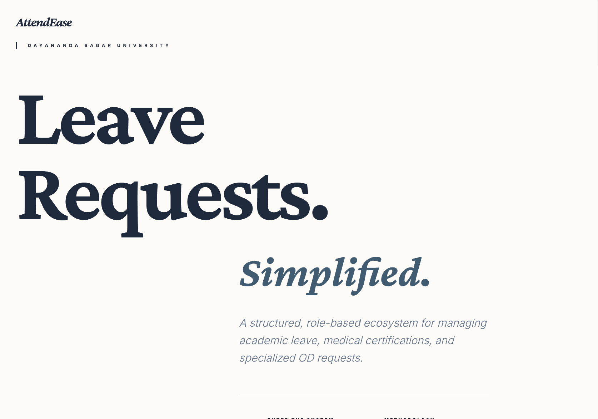

# AttendEase: Professional Campus Leave Management

> **Leave Requests. Simplified.** 
> A structured, role-based ecosystem for managing academic leave, medical certifications, and specialized OD requests at Dayananda Sagar University.

---

### 🏛️ Digital Campus Experience

AttendEase redefines the bureaucratic process of attendance management with a high-performance, aesthetically driven platform. Built for students, faculty, and administrators, it ensures total transparency and security for every request.



---

### ✨ Key Features

- **Choreographed Reveal Animations**: A smooth, staggered entrance for every page component, creating a clean and premium user experience.
- **Identity Verification Portal**: Specialized login gateways for Students, Class Coordinators, Year-wise Coordinators, and Chairpersons.
- **Secure Google OAuth**: Integrated "Continue with Google" for fast and secure access using university credentials.
- **Intelligent Recovery**: Self-service "Access Recovery" portal with automated email transmission for forgotten passwords.
- **Academic Rigor Design**: A minimal, typography-focused aesthetic that reflects the professional environment of Dayananda Sagar University.

---

### 🛠️ Technology Stack

| Layer | Technology |
| :--- | :--- |
| **Frontend** | React (Vite) + TypeScript |
| **Styling** | Tailwind CSS v4 |
| **Backend** | Node.js + Express |
| **Database** | Prisma ORM (MySQL) |
| **Auth** | JWT + Google OAuth 2.0 |
| **Email** | Nodemailer (Secure SMTP) |

---

### 🚀 Local Development

#### 1. Backend Configuration
```bash
cd backend
npm install
```
Configure your `.env` with your database URL, JWT secrets, and Google credentials.
```bash
npx prisma db push
npm start
```

#### 2. Frontend Launch
```bash
cd frontend
npm install
npm run dev
```

The application will be available at [http://localhost:5173](http://localhost:5173).

---

### 🔐 Security & Validation
- **Pattern Matching**: Strictly enforces `eng********@dsu.edu.in` email formats.
- **Encrypted Proofs**: All medical and OD certifications are served via authenticated pathways.
- **Rate Limiting**: Protects every endpoint from brute-force attempts.

---
© 2026 AttendEase Intelligence · Dayananda Sagar University Proprietary
